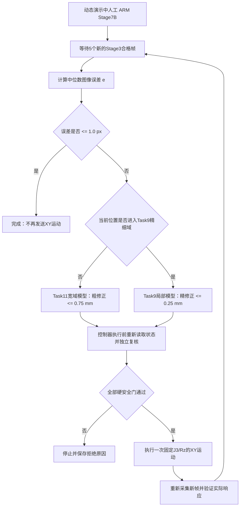

# Task11 与 Stage7B 更新报告

- 更新日期：2026-08-15
- 项目：2D Robot Control / RobotArm_SCARA_Control 0812
- 本次范围：P22 周围 20×20 mm 宽域图像误差模型、Task9 精细模型切换、有限次数自动 XY 视觉闭环
- 硬件验证状态：未连接相机或机械臂；已完成静态检查、运动学仿真、假控制器和离屏 UI 测试

## 1. 更新目标

本次更新将原有的 P22 局部高精度 Jacobian 扩展为两级视觉控制：

1. P22 较远区域使用 Task11 标定的 20×20 mm 宽域模型进行粗对准；
2. 进入 Task9 的局部有效域后，自动切换到原有高精度 Jacobian；
3. 图像误差达到最终阈值后停止 XY 闭环；
4. 所有运动仍由 `ActionWorker` 统一下发，并在运动前重新读取控制器状态、复核运动学和安全门；
5. Stage7B 不包含 Z、DO、真空或放片动作。

## 2. Task11 宽域标定

### 2.1 采集设计

Task11 以 `P22 float` 为中心，使用以下位置：

- 5×5 训练网格：X/Y = `-10、-5、0、+5、+10 mm`；
- 每个训练节点从不同路径方向访问两次；
- 独立 4×4 验证网格：X/Y = `-7.5、-2.5、+2.5、+7.5 mm`；
- 每次访问采集 5 帧相机1图像；
- 合计 66 次访问、330 个状态点、330 张照片；
- 为降低控制器逐轴执行时的瞬时位移和 Rz 偏离，路径被拆分为不超过 0.90 mm 的 Cartesian 中转目标；
- 全程固定 J3 和绝对 Rz，结束后精确返回 `P22 float`。

### 2.2 宽域模型方程

图像误差定义保持与 Task9 完全一致：

\[
\mathbf e =
\begin{bmatrix}e_u\\e_v\end{bmatrix}
=
\mathbf p_{slot}-\mathbf p_{suction}
\]

程序同时拟合两个候选模型。

全局仿射模型：

\[
\mathbf e(x,y)=
\mathbf c_0+\mathbf c_xx+\mathbf c_yy
\]

二次空间模型：

\[
\mathbf e(x,y)=
\mathbf c_0+\mathbf c_xx+\mathbf c_yy+
\mathbf c_{xx}x^2+\mathbf c_{xy}xy+\mathbf c_{yy}y^2
\]

当前位置的 Jacobian 由模型对 X/Y 求偏导获得：

\[
J(x,y)=\frac{\partial\mathbf e}{\partial[x,y]}
\]

只有通过独立 4×4 验证网格的最简单模型才会安装。若仿射模型已经足够，就不会无必要地采用二次模型。

### 2.3 Task11 质量门

主要质量门包括：

- 25 个训练节点全部存在；
- 16 个独立验证节点全部存在；
- 每一次重复访问均有足够的 Stage3 合格帧；
- 同一节点的两次访问结果具有足够重复性；
- 训练 RMS、独立验证 RMS、验证最大误差均低于限制；
- Jacobian 条件数和最小奇异值合格；
- 独立验证得到的经验 Jacobian 与模型导数一致；
- 预测修正方向必须使误差下降；
- 任一位置全部帧被拒绝时，该访问仍会明确判定失败，不能被另一次有效访问掩盖。

Task11 只有在所有质量门通过时，才会安装：

`src/scara/calib/camera1_wide_xy_jacobian.json`

## 3. Stage7B 两级有限自动闭环

### 3.1 模型切换

标定和运行边界故意保留保护余量：

| 模型 | 标定范围 | Stage7B 实际授权范围 | 单步上限 |
|---|---:|---:|---:|
| Task11 宽域模型 | 每轴 ±10 mm | 每轴 ±9.5 mm | 0.75 mm |
| Task9 精细模型 | 每轴 ±2 mm | 每轴 ±1.8 mm | 0.25 mm |

因此，精确处于 ±10 mm 或 ±2 mm 边界时不会直接使用边缘数据外推。若将来需要让 ±10 mm 成为实际运行范围，应扩大标定范围，而不是删除保护余量。

### 3.2 反馈方程

每轮先使用 5 个新的 Stage3 合格帧，并对图像误差取中位数：

\[
\tilde{\mathbf e}_k=\operatorname{median}
(\mathbf e_{k,1},\ldots,\mathbf e_{k,n})
\]

完整抵消命令为：

\[
\Delta\mathbf q_{full}=-J_k^{-1}\tilde{\mathbf e}_k
\]

实际候选命令经过增益和向量限幅：

\[
\Delta\mathbf q_k=
\operatorname{clip}_{norm}
(g\Delta\mathbf q_{full},s_{max})
\]

预计终点和预计误差为：

\[
\mathbf q_{k+1}^{pred}=\mathbf q_k+\Delta\mathbf q_k
\]

\[
\mathbf e_{k+1}^{pred}=
\tilde{\mathbf e}_k+J_k\Delta\mathbf q_k
\]

进入下一轮后，程序比较实际误差变化和模型预测：

\[
\mathbf r_k=
(\tilde{\mathbf e}_{k+1}-\tilde{\mathbf e}_k)-
J_k\Delta\mathbf q_k
\]

创新残差过大、误差未改善或命令跟踪失败时，闭环停止，不会在线改写正式 Jacobian。

### 3.3 有限运行边界

- 最终收敛阈值：`|e| ≤ 1.0 px`；
- 最多 32 次实际 XY 运动；
- 第 32 次运动后保留一次只观察的最终确认轮，不允许第 33 次运动；
- 累计 XY 路径不超过 15 mm；
- 宽域单步不超过 0.75 mm；
- 精细域单步不超过 0.25 mm；
- 每轮都重新读取控制器状态；
- 每轮固定 J3 和标定时的绝对 Rz；
- 不包含 Z、DO、真空或接触动作。

靠近有效域边缘时，若 Cartesian 终点在域内、但控制器按照 J4 预补偿→J1→J2→J3→最终 J4 的逐轴顺序会让中间轨迹越界，程序会依次尝试原命令的 `1、0.5、0.25、0.125` 倍。所有比例都不安全时立即停止。

## 4. 动态演示 UI 更新

“手眼交互 → 动态演示”现在包含两种明确分离的模式：

1. 普通动态演示和 Jacobian 验证：继续保持只计算、不运动；
2. Stage7B 有限闭环：必须点击独立按钮并完成人工 ARM 确认，才可能发送受限 XY 运动。

Stage7B 运行时显示：

- 当前使用的是 Task11 粗模型还是 Task9 精细模型；
- 修正前 `eu、ev、|e|`；
- 候选 `ΔX、ΔY`；
- 预计终点 world XY；
- 预计修正后误差；
- 当前轮全部计算门和运动门；
- ARM、运行、收敛、拒绝或停止状态。

窗口关闭在 Stage7B 活动期间会被阻止。停止 Stage7B 会中断待执行请求并阻止后续授权；机械臂面板原有的物理/UI 急停入口保持可用。

## 5. 数据和审计输出

### 5.1 Task11 输出

Task11 运行目录保存：

- 原始照片：`1_001.jpg` 等；
- 逐点机械臂状态：`points.json`；
- 宽域标定结果：`camera1_wide_xy_jacobian.json`；
- 人员可读摘要：对应 Markdown 报告；
- 成功时原子安装正式宽域标定文件。

结果锁定以下输入的 SHA-256：

- 相机1内参；
- 托盘几何；
- Task8 suction target；
- Task9局部 Jacobian。

任一上游文件发生变化，旧宽域模型不会被 Stage7B 使用。

### 5.2 Stage7B 输出

每次 Stage7B 会话保存：

- 每轮使用的 5 张标注图：`1_001.jpg` 等；
- 完整会话：`stage7b_closed_loop.json`；
- 动作执行审计：`points.json`；
- 逐轮摘要：`stage7b_waypoints`。

逐轮记录包括：

- 当前 world XY 和相对 P22 偏移；
- 修正前图像误差；
- 模型层级；
- 完整抵消量和实际限幅命令；
- 预计终点和预计误差；
- 所有安全门；
- 控制器执行前、执行后状态；
- 实际运动结果；
- 两个 Jacobian 文件的哈希值。

## 6. 文件更新清单

### 6.1 新增任务文件

| 文件 | 作用 |
|---|---|
| `Preset Trajectories/task11.py` | 生成 Task11 的 5×5双访问训练网格、4×4独立验证网格、固定J3/Rz的分段运动、状态记录和相机1拍照动作。自身不包含拟合方程。 |

### 6.2 新增视觉和闭环模块

| 文件 | 作用 |
|---|---|
| `src/scara/vision/wide_xy_jacobian.py` | 纯计算宽域模型：帧/访问聚合、仿射与二次拟合、位置相关 Jacobian、独立验证、质量门和粗修正方程。不导入控制器。 |
| `src/scara/vision/wide_xy_jacobian_runtime.py` | Task11 运行时：复用 Stage3 处理每张照片、绑定预定访问顺序、拟合宽域模型、保存 JSON/Markdown、通过后原子安装正式标定。 |
| `src/scara/vision/stage7b_servo.py` | Stage7B 纯计算核心：稳定帧聚合、两级模型选择、修正计算、限幅、预计响应、上一轮响应验证、运动学规划和安全门。 |
| `src/scara/vision/stage7b_session.py` | Stage7B 会话协调器：加载并核验两个 Jacobian、生成有限动作请求、保存每轮图片和 JSON、构建给 ActionWorker 的候选响应。自身不控制硬件。 |

### 6.3 修改的通用视觉模块

| 文件 | 作用 |
|---|---|
| `src/scara/vision/xy_image_jacobian_runtime.py` | 将原来仅支持 Task9 的运行时参数化，使其在保持 Task9 默认行为不变的同时，能被 Task11 复用更大的偏移数量、范围和安全提示。 |
| `src/scara/vision/handeye_interaction.py` | 为实时评估补充不可变帧ID、采集时间、当前关节和当前位姿，使 Stage7B 能确认视觉数据与控制器请求属于同一状态。 |
| `src/scara/vision/__init__.py` | 登记新增的宽域 Jacobian 与 Stage7B 模块。 |

### 6.4 修改的 UI 和动作执行模块

| 文件 | 作用 |
|---|---|
| `src/scara/ui/handeye_demo_dialog.py` | 在动态演示弹窗增加 Stage7B ARM/停止按钮、异步5帧采集、逐轮误差/修正/预计终点/安全门显示，并保持普通演示只读。 |
| `src/scara/ui/control_widget.py` | 管理 Stage7B 的启动、停止、相机1要求、ActionWorker生命周期和UI锁定；保持急停入口可用。 |
| `src/scara/ui/action_worker.py` | 新增 Stage7B 专用运行请求协议；在每次运动前重新读取控制器状态，独立复核hash、模型层级、终点、J3/Rz、局部域和逐轴中间轨迹；支持收敛后正常提前结束。 |

### 6.5 新增说明文档

| 文件 | 作用 |
|---|---|
| `docs/stage5_wide_xy_jacobian.md` | 说明 Task11 采集设计、宽域模型方程、模型选择、独立验证、质量门和适用边界。 |
| `docs/stage7b_finite_closed_loop.md` | 说明两级闭环方程、模型切换、响应验证、运动上限、安全边界和输出数据。 |
| `Task11_Stage7B_Update_Report.md` | 本文件；汇总本次所有更新、文件职责、运行流程和现场验收步骤。 |

### 6.6 新增/更新测试

| 文件 | 作用 |
|---|---|
| `tests/test_wide_xy_jacobian.py` | 验证仿射/二次模型恢复、独立验证拒绝、缺失节点、零有效帧和位置相关修正。 |
| `tests/test_task11_wide_xy_jacobian.py` | 验证 Task11 的330帧契约、无Z/DO/真空、固定姿态、路径与逐轴瞬态限制、成功才安装标定。 |
| `tests/test_stage7b_servo.py` | 验证宽/精模型切换、收敛、越界拒绝、发散拒绝、最终只观察轮和最远角点收敛。 |
| `tests/test_stage7b_session.py` | 验证会话动作有限、两个hash锁定、图片/JSON保存以及实际 ActionWorker 假控制器闭环。 |
| `tests/test_stage7b_action_integration.py` | 验证 Stage7B 请求不能放宽硬上限、Task9精细层会被重新按精细边界复核、收敛后无多余运动。 |
| `tests/test_stage7b_dialog_async.py` | 验证只使用请求之后的新帧、5帧满足才释放请求、超时零运动和异步UI行为。 |

## 7. 已完成的软件验证

在 `scara_cvdev` 环境中完成：

- `compileall` 通过；
- 完整离线测试：109/109 通过；
- Task11 使用实际项目的 `P22 float` 预设成功构建；
- Task11 构建摘要：66次访问、466个分段移动、330个记录点、330张照片；
- 最坏宽域角点 `(P22 + 9.4 mm, +9.4 mm)` 仿真通过；
- 边缘首步因逐轴中间轨迹约束自动退让，随后完成宽域→精细域切换并在15 mm累计路径内收敛；
- UI测试使用离屏Qt；
- 控制器测试使用内存假控制器；
- 未创建真实 `VideoCapture`，未连接真实控制器，未发送机械臂、DO或真空指令。

## 8. 现场尚需完成

当前 `src/scara/calib/camera1_wide_xy_jacobian.json` 尚不存在，因为 Task11 还没有在真实硬件上执行。这是预期的 fail-closed 状态；Stage7B 在正式宽域模型不存在或任一hash不匹配时不会 ARM。

推荐现场步骤：

1. 无硅片、低速、物理急停可用；
2. 将机械臂精确置于 `P22 float`；
3. 导入并执行 `task11.py`；
4. 检查运行结果为 `status: success` 且所有宽域质量门通过；
5. 确认正式宽域标定文件已安装；
6. 第一次 Stage7B 从偏离 P22 约 2–3 mm 的位置开始；
7. 检查粗模型方向、Task9切换和最终停止；
8. 再逐步扩大到 5 mm、8 mm 和接近宽域边缘；
9. Stage7B 验证成功后，才能继续设计包含 Z 和放片动作的后续阶段。

## 9. 回滚信息

同步到 Desktop 项目前，6个既有文件已备份到：

`C:\Users\Admin\AppData\Local\Temp\RobotArm_SCARA_Control_0812_stage7b_backup_20260815`

该备份只用于必要时回滚本次覆盖的既有源码；Task11、Stage7B和新测试文件原先不存在。
