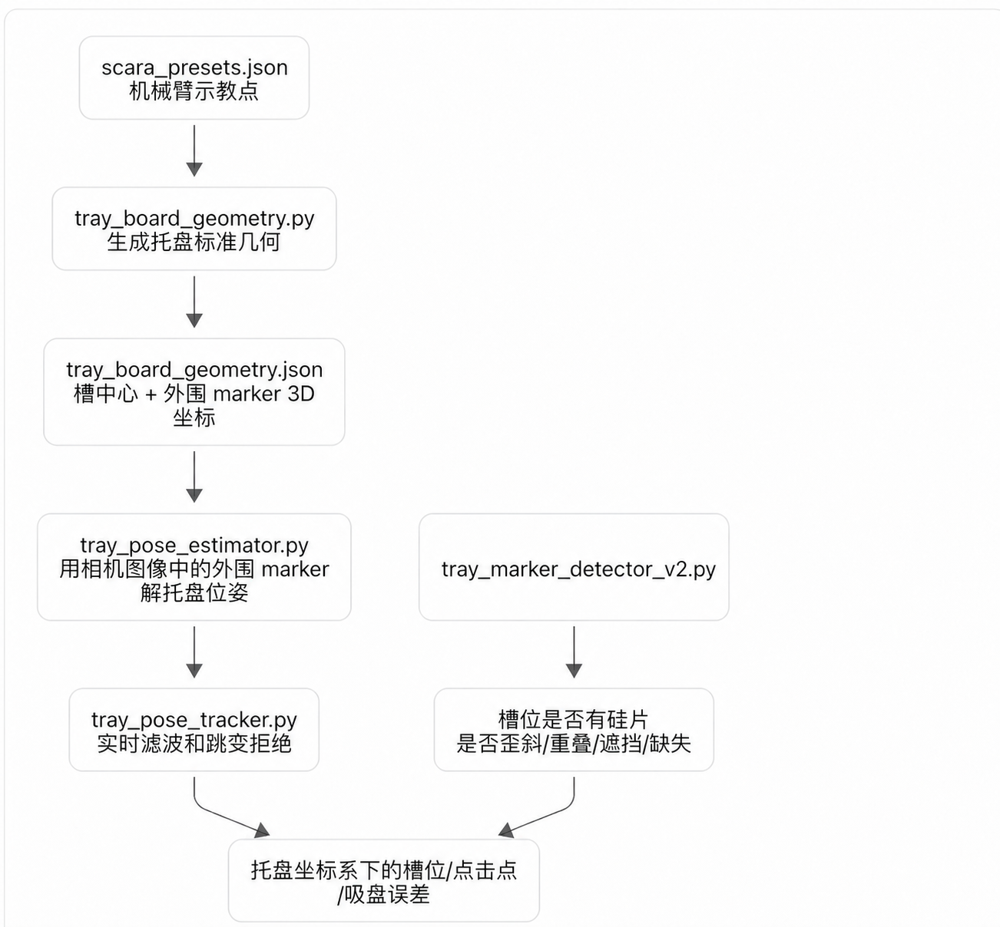

# Tray Marker 分层合并记录

日期：2026-08-18
开发分支：`agent/integrate-tray-marker-vision`

## 1. 合并范围

旧版工具完整保留在 `tools/tray_marker_detector_v2/`，用于结果对照和回归。新代码没有修改 SCARA 控制、ActionWorker、拍照流程或任何机械臂运动接口。

本次把可复用逻辑按职责放入 `src/scara/vision/`：

1. `slot_marker_observation.py`
   - 从 `tray_board_geometry.json` 读取固定的 `P00...P55` 毫米坐标。
   - 通过合格的 `^C T_T` 位姿把 36 个槽投影到当前图像。
   - 从旧 `tray_marker_layout.json` 读取每个槽内固定的 marker ID。
   - 多尺度识别 `DICT_4X4_50` marker，记录中心、四角、角度、面积和方形质量。
   - 按 `src/scara/calib/silicon_detection_0818.json` 的
     `tray_vision.canonical_patch_size` 把每个槽透视校正为统一小图。

2. `wafer_shape_quality.py`
   - 在透视校正后的单槽小图中检测紫色/深色高饱和度硅片。
   - 使用面积、边长、长宽比、矩形度、实心度、中心偏移、相对角度、轮廓顶点、连通块和内部边线判断正常、警告或异常。
   - 单独的内部直线和第二颜色连通块只作为警告证据；只有内部边形成有效L角，或检测到第二个方形轮廓，才确认叠片。
   - 要求候选区域具有足够的紫色色彩比例，避免把黑白 ArUco marker 当成硅片。

3. `tray_occupancy.py`
   - 状态包括 `empty`、`empty_unread_marker`、`occupied`、`warning`、`stacked`、`outside_slot`、`stacked_outside_slot`、`out_of_view`、`occluded` 和 `unknown`。
   - 原来的笼统 `abnormal` 已拆分：只有 `stacked_geometry_confirmed` 才显示“叠片”；轮廓接触或越过槽边界时显示“槽外”；两类证据同时成立时显示“叠片且槽外”。其他槽内严重形状异常降为“警告”，不再冒充叠片。
   - 画面不完整时标为 `out_of_view`，不会标为 missing。
   - 只有显式传入遮挡 mask 时才使用 `occluded`；新相机默认没有固定机械臂 mask。
   - 没有 marker、没有可靠硅片、也没有明确遮挡时标为 `unknown`，不猜测为空槽。

4. `tray_vision_fusion.py`
   - 先调用现有 `tray_pose_estimator.py`。
   - 位姿重投影质量门不通过时停止 36 槽分析和坐标转换。
   - 位姿通过后依次执行槽投影、slot marker 观测、硅片质量判断和槽状态融合。
   - 提供点击像素到托盘平面毫米坐标、最近槽位和距离的只读转换。
   - 当前不直接给出机械臂运动量；仍需经过现有吸盘目标和手眼标定层。

## 2. 固定槽位与 marker ID

旧 layout 的图像行列方向与当前 Tray Frame 的 `P00...P55` 方向不同。对 `260812015730` 中四张相机 1 图片比较了正方形网格的 8 种旋转/镜像关系，固定采用：

```text
metric P(row, col) -> legacy layout(col, 5 - row)
metric_slot_transform = rot270
```

在位姿质量通过的 `1_012.jpg` 和 `1_023.jpg` 上，该映射的 marker 中心误差中位数为 `12.47 px`、90 分位数为 `20.50 px`；其余映射的中位数均大于 `216 px`。该关系已写入 `tools/tray_marker_detector_v2/tray_marker_layout.json`。运行时只读取固定关系，不根据当前照片重新排序 ID。

## 3. 判断顺序

以下门槛均从 `src/scara/calib/silicon_detection_0818.json` 读取。该文件是相机1
分层硅片检测的参数真值源；代码和本文不再各自维护另一份数值。JSON中的
`wafer_quality` 同时覆盖“是否找到可靠硅片候选”和“硅片状态”，`slot_decision`
覆盖画面完整度与显式遮挡状态，`tray_vision` 覆盖槽图物理范围和分辨率。

每个槽按以下顺序决策：

1. 槽投影覆盖率不足 `slot_decision.minimum_image_coverage_ratio`：`out_of_view`。
2. 显式遮挡 mask 覆盖率达到 `slot_decision.explicit_occlusion_ratio`：`occluded`。
3. 找到硅片候选：按形状与边界证据给出 `occupied`、`warning`、`stacked`、
   `outside_slot` 或 `stacked_outside_slot`。
4. 识别到该槽配置的 marker ID：`empty`。
5. 能看到黑白 marker 图案但 ID 未解码：`empty_unread_marker`。
6. 以上证据都不足：`unknown`。

## 4. 离线入口

```bash
cd /Users/chenge/Desktop/二维机器人/2DRobot
python3 tools/analyze_layered_tray.py \
  /Users/chenge/Desktop/二维机器人/260812015730/1_023.jpg \
  --output-json layered_tray_result.json \
  --output-image layered_tray_annotated.png
```

增加点击像素测试：

```bash
python3 tools/analyze_layered_tray.py IMAGE.jpg --click 640 360
```

输出 JSON 中会增加 `point_T_mm`、`nearest_slot` 和 `nearest_slot_distance_mm`。位姿质量门失败时 click 结果被拒绝。
默认读取 `src/scara/calib/silicon_detection_0818.json`；可用
`--silicon-config PATH.json` 选择另一份完整配置，输出JSON会记录所用文件、配置名和
SHA256。

## 5. 验证结果

新增测试：

```bash
python3 -m unittest tests.test_tray_marker_layered_integration -v
```

共 22 项，覆盖固定 ID 映射、36 槽投影、像素到 Tray 坐标往返、多尺度 marker、正常硅片角度、反光内部边负样本、L角叠片、第二四边形叠片、双轮廓相机叠加、槽边界越界、叠片/槽外组合状态、二维码误识别、画面外状态、空槽/占用状态、硅片中心毫米偏差、滤波位姿复用和 tracker fail-closed，全部通过。

真实图片结果：

| 图片 | 位姿结果 | 槽位结果 |
|---|---|---|
| `1_001.jpg` | 拒绝 | Marker 5 RMS `3.082 px > 3.000 px`，不分析槽位 |
| `1_012.jpg` | 通过，RMS `1.770 px` | 1 empty，1 abnormal，29 out_of_view，5 unknown |
| `1_023.jpg` | 通过，RMS `1.662 px` | 19 empty，14 out_of_view，3 unknown |
| `1_034.jpg` | 拒绝 | 只识别到 2 个外围 marker，不分析槽位 |

全仓库测试在当前系统 Python 下有 16 个导入错误，原因均为未安装 `PyQt6`；本次新增测试和不依赖 Qt 的原有视觉/数值测试通过。

## 6. 架构图



图中已删除“你的”。

## 7. 当前边界

- 本次只合并相机 1 的托盘总览逻辑。
- 相机 2 的吸盘和被提起硅片必须作为独立观测源，不能进入托盘占用判断。
- `robot_correction_allowed` 当前固定为 `false`。只有将点击点/目标槽的 Tray 坐标交给现有手眼标定和吸盘目标模块，并再次通过质量门后，才可计算机械臂修正量。
- `1_012.jpg` 中的大面积深色遮挡被标为 abnormal。后续应使用新相机的无遮挡数据重新标定硅片色彩范围，并为临时遮挡接入显式 mask 或独立遮挡分类器。

## 8. 相机1手眼交互 UI 集成

`HandEyeMonitorThread` 现在对每个新鲜相机1帧执行同一条只读链路：Stage3
位姿与时序质量门、36槽 TrayVision 分析、手眼目标叠加，最后一次性把标注图、
手眼结果和 TrayVision 结果发送给 Qt 主线程。TrayVision 使用 tracker 的滤波
`T_C_T` 重建一致的 `rvec/tvec`，不会重复运行第二次 Stage3，也不会在 tracker
拒绝跳变帧后继续使用旧位姿。

动态画面下方新增36行槽状态表，固定按 `P00...P55` 排列，显示占用三态、
Tray Frame 中的 `ΔX_T`、`ΔY_T`、平面距离和中文硅片状态。占用三态规则为：

- `occupied/warning/stacked/outside_slot/stacked_outside_slot`：是；
- `empty/empty_unread_marker`：否；
- `out_of_view/occluded/unknown`：不确定。

叠片几何确认后，相机1动态图用状态色绘制主轮廓并标注 `W1`，用青色绘制
推断或检测到的第二硅片四边形并标注 `W2`；相同轮廓同时写入离线 JSON。

UI相机和任务相机每次打开时都默认请求自动曝光。手眼动态UI另提供“相机1硬件曝光”
整数滑杆，范围 `-13...-1`、步进 `1`，显示初值为 `-6` 但不会自动写入。只有操作者
实际拖动滑杆或点击“应用”后，才会由拥有
`VideoCapture` 的采集线程关闭自动曝光并调用 `CAP_PROP_EXPOSURE` 写入整数档位；
负数越小画面通常越暗，每降低一档曝光时间约减半。线程会尝试核对自动/手动模式；
若某些UVC驱动固定返回 `1.000` 或 `-1.000`，则以曝光写入成功、整数精确读回及
数帧后的稳定读回作为最终证据。小数、越界值或曝光读回不一致会被拒绝。若画面亮度异常
降至接近黑屏，会立即恢复自动曝光。“恢复自动曝光”可强制回到驱动自动模式，关闭
窗口也会恢复应用默认的自动曝光。导入任务不能指定固定曝光；任务自有相机同样默认
自动曝光，并且在释放设备前再次请求自动模式。整个流程只修改相机硬件，不处理已采集
BGR像素。

曝光控件下方的“硅片判定参数”按钮使用Windows原生文件选择窗口加载JSON。只有
字段完整、类型和参数关系都通过校验的配置才会应用；无效文件不会覆盖当前配置。
验证通过后，UI先把所选路径原子保存到Git忽略的
`local_silicon_detection_selection.json`，再让后台分析器从下一张新鲜帧开始使用新参数；
关闭并重新进入动态演示时仍加载该配置，直到用户选择另一份JSON。工程内文件使用相对
路径保存，工程外文件使用绝对路径。若保存的文件后来丢失或损坏，UI会显示回退提示并
使用 `src/scara/calib/silicon_detection_0818.json`，不会静默沿用失效参数。切换不重启
相机，也不改变机械臂控制。界面显示当前文件名、配置名和SHA256前缀，完整路径位于提示信息中。

硅片中心由配置指定的统一槽图转换为毫米坐标。设
`h=tray_vision.slot_half_extent_mm`、`N=tray_vision.canonical_patch_size`、中心像素为
`(u,v)`，则：

```text
ΔX_T = h * (1 - 2v/(N-1))
ΔY_T = h * (1 - 2u/(N-1))
distance = hypot(ΔX_T, ΔY_T)
```

没有可靠硅片时这些值为 `null`，UI 显示 `—`。位姿拒绝、画面冻结超过1秒、
相机断开或后台异常时，旧图和旧表格结果同时失效，36行全部恢复为“不确定”。
此 UI 集成仍不产生机械臂命令，`robot_correction_allowed` 保持 `false`。
