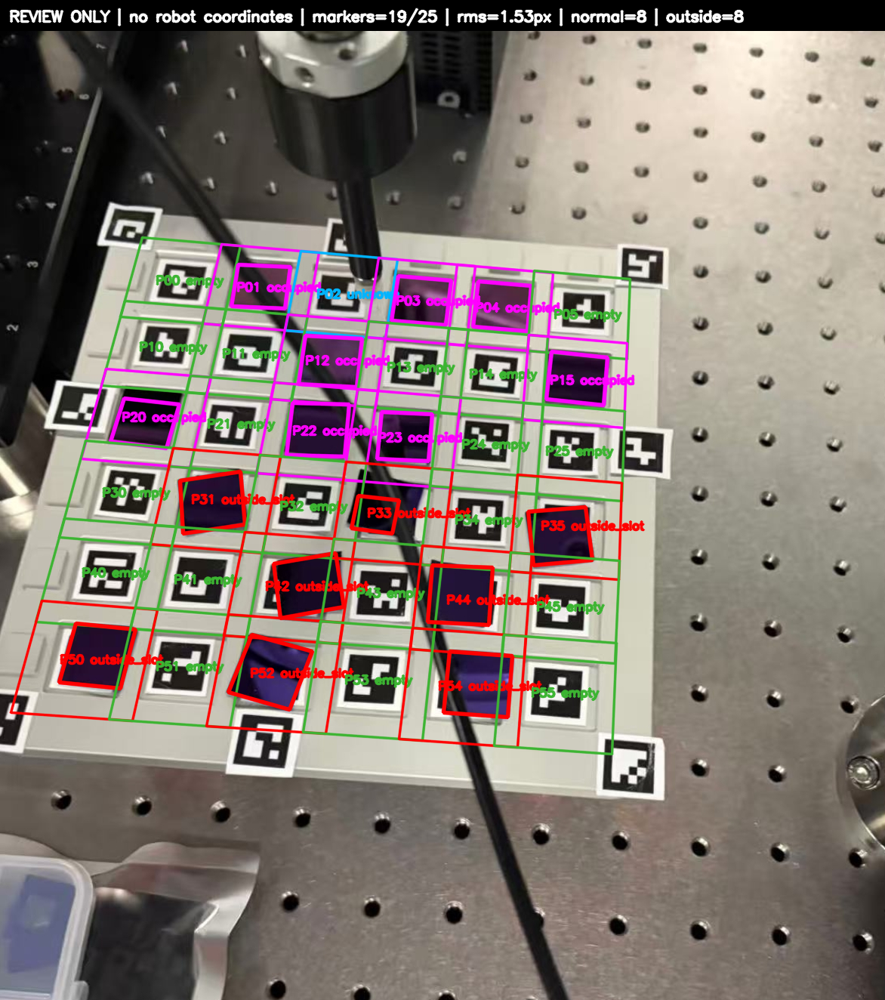

# 0820 硅片识别修改与验证记录

日期：2026-08-20
分支：`agent/integrate-tray-marker-vision`
本轮开发基点：`557b522`（合并 `origin/main` 后）

## 1. 目标

1. 合并 `origin/main` 的最新拍照、标定和 Task14 数据流。
2. 把正常放在槽内的紫色硅片与放在槽外的硅片稳定分开。
3. 降低反光、相邻槽色块、ArUco marker 和画面裁切引起的误判。
4. 为点击拾取导航提供多帧稳定的 `occupied` 证据，但不下发任何机械臂命令。

## 2. 识别链路

每个槽使用固定 marker ID 和固定毫米坐标，先透视校正成 `192 x 192`
的托盘对齐小图。小图覆盖槽中心周围 `31 x 31 mm`；边长约 `21 mm`
的内部正方形是可接受槽区，外圈仅用来保留放歪硅片的完整四角。

1. 用紫色种子掩码确定硅片主体，强饱和度和暗色有色区只作低照度补充。
2. 对主体轮廓的 2%--98% 支持点做稳健旋转矩形拟合，得到中心、四角、长宽和角度。
3. 若主硅片与相邻紫色区域只由细桥连接，只在正方形度明显改善且中心不变差时切断细桥。
4. 使用长宽比、矩形度、实心度、中心偏移、相对托盘角度和边长评估是否为正常单片。
5. 只有轮廓足够接近正方形（槽外专用长宽比上限 `1.20`），且四角穿过内部槽区时，才输出 `outside_slot`。
6. 裁切、反光或不规则色块虽接触槽边，但无法可靠拟合四角时，输出 `warning + boundary_crossing_unconfirmed`。
7. 只有独立第二正方形或可复核的 L 形重叠角才确认叠片；内部反光线本身不确认叠片。

## 3. 0820 人工标注样本

回归图片：`tests/fixtures/silicon_detection/0820_upper_normal_lower_outside.jpg`
人工标注：`tests/fixtures/silicon_detection/0820_upper_normal_lower_outside.json`

| 类别 | 槽位 | 数量 |
|---|---|---:|
| 正常槽内 | `P01 P03 P04 P12 P15 P20 P22 P23` | 8 |
| 槽外 | `P31 P33 P35 P42 P44 P50 P52 P54` | 8 |
| 空槽 | 其他可见且 marker 可解码的槽 | 19 |
| 不确定 | `P02`（吸盘/工具遮挡） | 1 |

原图与缩放到 75% 的图片都得到相同的集合。



## 4. 旧图回归

1. 旧图 `8-36 flake 2-stacked 6-crooked/...152338_835838.png` 中，旧版
   `R6C3` 映射为当前 `P35`，仍保持槽外，最小安全余量比为 `-0.159`。
2. 同图旧版 `R6C4` 映射为 `P25`，细桥分离后为正常槽内，最小安全余量比为 `+0.042`。
   两个槽图已固定为 `tests/fixtures/silicon_detection/0805_P35_expected_outside.png`
   和 `0805_P25_expected_normal.png`，不再依赖桌面旧图目录才能测试。
3. 旧照片分辨率和当前相机1标定不一致，不得使用当前 PnP 结果生成机械臂坐标。
4. 常规拟合至少需要 3 个固定 marker，且在托盘 X/Y 两轴都覆盖 `60 mm`。两个外围 marker 仅在四角完整、同时跨两轴时进入低置信度离线复核；同边双 marker 仍拒绝。
5. 全量重放 `images` 的 173 张和 `images 0805` 的 190 张照片，共 363 张；339 张通过复核几何门，24 张因 marker 数量、双轴跨度或残差不足而拒绝。
6. 全量真值、逐图结果和人工复核记录见 `docs/wafer_dataset_full_audit.md`。
7. 未获得独立真值的槽位不参与精度声明，不将程序输出反写为真值。

## 5. 实时拾取导航安全门

1. 只能选择当前帧为 `occupied` 的槽。
2. 最近 5 张不同序号的合格帧中至少 3 张必须为 `occupied`，且最新帧仍为 `occupied`；重复帧不累计。
3. `warning` / `stacked` / `outside_slot` / `unknown` / `out_of_view` 均不得锁定为拾取源。
4. 导航还需要合格的托盘位姿、运行时 `W←T` 登记以及新鲜且时间同步的机械臂位姿。
5. UI 只画出吸盘 XY 到锁定槽的箭头并显示偏差，`robot_motion_authorized` 始终为 `false`。

## 6. 复现命令

```bash
cd /Users/chenge/Desktop/二维机器人/2DRobot

PYTHONPATH=src python3 tools/review_marker_grid_wafers.py \
  tests/fixtures/silicon_detection/0820_upper_normal_lower_outside.jpg \
  --output-json /tmp/wafer_0820.json \
  --output-image /tmp/wafer_0820.png

PYTHONPATH=src python3 -m unittest \
  tests.test_silicon_detection_config \
  tests.test_wafer_transfer_tracking \
  tests.test_marker_grid_wafer_review \
  tests.test_tray_marker_layered_integration -v
```

上述四组与本次直接相关的测试现为 66 项，全部通过。当前 macOS 系统 Python
未安装 `PyQt6`，因此本轮没有把依赖 Qt 导入的 UI 测试计入通过数。

## 7. 输出边界

`tools/review_marker_grid_wafers.py` 仅用于旧图和任意分辨率照片的识别复核；其 JSON
始终包含 `coordinate_mapping_allowed=false` 和 `robot_motion_authorized=false`。实时机械臂坐标只能由
当前标定分辨率的相机1链路生成，不能从旧图 homography 外推。

## 8. 查看修改

```bash
cd /Users/chenge/Desktop/二维机器人/2DRobot
git status --short
git diff 557b522 -- src/scara/vision src/scara/ui tests tools docs README.md
```

`git diff` 显示已跟踪文件的本轮修改；`git status` 另外列出新增模块、测试、夹具和标注图。
本轮结果未自动推送。
