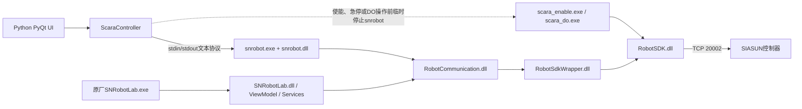

# `snrobot.exe` 文件格式、桥接机制与依赖分析

> 分析对象：`C:\Program Files\SIASUN\SNRobotLab\snrobot.exe` 及其同目录运行组件  
> 分析方式：只读静态分析，包括PE元数据、文件哈希、.NET程序集引用、可见字符串和IL流程检查  
> 分析日期：2026-08-12  
> 安全说明：分析过程中没有启动、修改或替换控制程序，也没有向机械臂发送命令。

## 核心结论

`snrobot.exe` 不是SIASUN原厂 `SNRobotLab.exe` 图形界面，也不是包含完整机器人运动学和伺服算法的控制器程序。它是一个体积很小的.NET 8命令行启动器；实际桥接逻辑位于同目录的 `snrobot.dll`。

它的主要职责是：

1. 连接 `192.168.1.100:20002` 的SIASUN控制器；
2. 从标准输入读取Python UI发来的文本命令；
3. 将命令翻译成 `RobotCommunication.dll` 的方法调用；
4. 把关节、位姿、状态和执行结果通过标准输出返回给Python；
5. 退出前停止点动并释放控制器连接。

Python UI和原厂UI不是互相调用关系，而是两个独立前端。它们最终调用同一套SIASUN SDK并访问同一个控制器，因此可能争抢TCP连接。

## 1. `.exe` 是怎样的文件格式

`.exe` 是Windows可执行文件的常用扩展名。现代Windows可执行文件通常采用PE（Portable Executable）格式。PE文件一般包含：

- DOS兼容头和PE文件头；
- 目标CPU架构和程序入口点；
- 代码段、只读数据段、资源段和重定位信息；
- 导入的DLL及操作系统API；
- 图标、版本号、清单等资源；
- 可选的数字签名和调试信息；
- 对于.NET程序，还可能只是一个启动.NET运行时的宿主壳。

当前 `snrobot.exe` 的静态信息如下：

| 项目 | 检查结果 |
|---|---|
| 文件格式 | Windows PE32+ |
| CPU架构 | AMD64 / 64位 |
| 文件大小 | 139,264 bytes |
| 文件版本 | 1.0.0.0 |
| 产品版本 | 1.0.0 |
| 数字签名 | 未签名（`NotSigned`） |
| SHA-256 | `445C33CBCDC876CA43C7BE1E1B2824E151EF3231A8F90899FE04B08DDBBD7424` |
| 运行时 | .NET 8及Windows Desktop Runtime |
| 实际托管程序 | 同目录的 `snrobot.dll` |

`snrobot.exe` 中可见.NET apphost和 `hostfxr.dll` 相关字符串，说明它主要负责寻找.NET运行时并加载 `snrobot.dll`，而不是直接保存全部C#业务逻辑。

同目录 `snrobot.dll` 的信息如下：

| 项目 | 检查结果 |
|---|---|
| 文件类型 | .NET托管程序集 |
| IL目标 | MSIL，PE32 |
| 文件大小 | 15,360 bytes |
| 程序集版本 | 1.0.0.0 |
| SHA-256 | `08A8393A34FF870B5A28A93DAA93968D784A10DA07357889D4A1D631162306A2` |
| 混淆情况 | 未发现明显混淆 |
| 主要类型 | `Program` |
| 主要方法 | `Main`、`RunCmd`、`PrepMotion`、`PrintReadAll`、`Joints` |

二进制中还保留了原始编译环境的PDB路径：

```text
D:\scara\apitest\obj\Release\snrobot.pdb
```

这说明桥程序很可能源自一个名为 `apitest` 的独立C#控制台项目，而不是原厂 `SNRobotLab.exe` 本身。

## 2. 桥接结构

### 2.1 文件和通信树状图

```text
Python PyQt UI
└─ src/scara/controller/scara_controller.py
   ├─ 启动：snrobot.exe serve
   ├─ stdin：逐行发送 readall / move1 / cartstep / jogstart 等命令
   ├─ stdout：读取命令结果，直到 <<END>>
   └─ 安全/DO旁路
      ├─ scara_enable.exe ─┐
      └─ scara_do.exe ─────┤
                            ▼
snrobot.exe（.NET 8 apphost启动壳）
└─ snrobot.dll（文本命令解析与SDK调用）
   ├─ Core.dll（日志等基础服务）
   └─ RobotCommunication.dll（原厂托管通信层）
      └─ RobotSdkWrapper.dll（托管/原生封装层）
         └─ RobotSDK.dll（原厂x64本地SDK）
            ├─ SiaSunRobot.lic
            ├─ SysConfig.xml
            └─ TCP 192.168.1.100:20002
               └─ SIASUN机器人控制器/控制器固件

原厂图形界面（另一条独立路径）
SNRobotLab.exe
└─ SNRobotLab.dll / ViewModel / Services
   └─ RobotCommunication.dll
      └─ RobotSdkWrapper.dll → RobotSDK.dll → 同一台控制器
```

### 2.2 Mermaid桥接图



图中最重要的一点是：`snrobot.exe` 并不自动操作原厂UI，也不模拟鼠标点击。Python UI和原厂UI分别调用相同的通信组件。两者若同时保持控制器连接，可能互相冲突。

## 3. Python UI具体如何调用桥程序

Python端的主要实现位于：

- [`src/scara/controller/scara_controller.py`](src/scara/controller/scara_controller.py)
- [`src/scara/config/scara_config.py`](src/scara/config/scara_config.py)

Python通过以下方式启动桥程序：

```text
snrobot.exe serve
```

同时把工作目录设置为 `snrobot.exe` 所在的SNRobotLab目录，并打开三个管道：

- Python → `stdin`：发送文本命令；
- `stdout` → Python：返回状态和结果；
- 进程状态：检测异常退出或超时。

桥程序连接成功后先输出：

```text
SERVE_READY
```

之后每收到一条命令，执行并输出若干结果行，最后输出：

```text
<<END>>
```

Python一直读取到 `<<END>>`，才把本次命令视为完成。为避免黑盒程序无响应导致UI或自动任务永久挂起，Python端另外实现了读取线程、命令超时和进程退出检测。

退出时Python发送：

```text
quit
```

桥程序随后停止各类点动、断开控制器并退出。

## 4. 文本命令与SIASUN SDK映射

通过对 `snrobot.dll` 的IL流程检查，可以恢复以下主要映射：

| 文本命令 | 桥程序的主要SDK调用 | 用途 |
|---|---|---|
| `readall` | `ReadJoint`、`ReadPosRPYAndCoord`、`ReadOperationMode`、`ReadWarning`、`ReadControlMode`、`ReadSpeedScale`、`ReadMechLock`、`GetIOList` | 一次读取关节、位姿和状态 |
| `pose` | `ReadPosRPYAndCoord` | 读取XYZ/RPY |
| `move1 axis delta ...` | `StepMov(G1, axis, delta)` | 单个关节相对运动 |
| `cartstep axis delta` | 切换World坐标及步进模式，然后调用 `StepMov(...)` | 世界XYZ相对运动 |
| `movej J1 J2 J3 J4` | 构造关节类型 `PositionModel`，调用 `Mov2Point(MovJ, ...)` | 四关节绝对目标运动 |
| `jogstart axis direction [world]` | `ChangeCorrdinate`、`SetMovType`、`JogMov` | 开始连续点动 |
| `jogkeep axis direction` | 再次调用 `JogMov` | 刷新连续点动看门狗 |
| `jogstop axis` | `JogMov(axis, Stop)` | 停止指定点动轴 |
| `stopall` | 停止多个点动轴，然后调用 `StopRobot` | 停止运动 |
| `setspeed percent` | `SetSpeedScale` | 设置速度比例 |
| `setmode mode` | `ChangeOperationMode` | 切换操作模式 |
| `home` | `PrepMotion` 后调用 `BackToHome` | 回零 |
| `enable` | 切控制权和T1后调用 `PowerRobot` | 旧版使能路径 |
| `disable` | `SetEnableStatus(0)` | 旧版去使能路径 |
| `clearalarm` | `ResetStop`、`ResetRobot`、`ClearAlarm` | 旧版报警复位路径 |
| `setdo channel level` | `WriteIOEnable`、`WriteIOForce` | 旧版DO路径 |
| `alarminfo` | `ReadAlarmInfo` | 读取报警详情 |

当前Python项目没有把桥中的旧使能、报警和DO路径作为最终权威实现：

- 使能、去使能、急停和报警状态主要走 `scara_enable.exe`；
- DO写入主要走 `scara_do.exe`；
- 执行这些辅助程序时，会临时断开 `snrobot serve`，以免多个程序抢占控制器TCP连接；
- Python会忽略 `snrobot readall` 中部分不可靠的 `ENABLE` 和 `WARN` 值，再用辅助程序的读数覆盖。

## 5. `snrobot.exe` 中有哪些重要方程

### 5.1 桥程序本身基本没有机器人运动学方程

静态IL中没有发现SCARA正运动学、逆运动学、轨迹插补或电机伺服方程。桥程序的核心是：

```text
解析文本参数
→ 设置控制模式/坐标类型/运动类型
→ 调用RobotCommunication方法
→ 打印结果
```

例如：

- `move1` 只是把 `axis` 和 `delta` 传给 `StepMov`；
- `cartstep` 只是切换到World坐标，然后把轴码和位移传给 `StepMov`；
- `movej` 只是把四个关节目标放入 `PositionModel`，再调用 `Mov2Point`；
- 真正的笛卡尔到关节转换、轨迹插补和底层控制很可能位于 `RobotSDK.dll` 或机器人控制器固件中。

桥程序内比较接近“计算”的逻辑只有：

- 从SDK返回的关节数组复制前4个值；
- 状态输出中将关节格式化为4位小数、位姿格式化为3位小数；
- `PrepMotion` 最多轮询20次，每次间隔200 ms，等待T1和使能状态就绪；
- 将文本参数转换为整数、浮点数或枚举值；
- 对输入数组长度进行少量处理。

### 5.2 项目自己的SCARA运动学方程

Python项目在 [`src/scara/pipeline/kinematics.py`](src/scara/pipeline/kinematics.py) 中定义了用于网格生成、视觉补偿和点位计算的SCARA几何模型。该模型不属于 `snrobot.exe`。

项目使用的连杆长度为：

```text
L1 = 225 mm
L2 = 175 mm
```

J4轴心的平面正运动学为：

$$
x = L_1\cos J_1 + L_2\cos(J_1+J_2)
$$

$$
y = L_1\sin J_1 + L_2\sin(J_1+J_2)
$$

末端方向为：

$$
R_z = J_1 + J_2 + J_4 - 90^\circ
$$

平面逆解首先计算：

$$
c_2 = \frac{x^2+y^2-L_1^2-L_2^2}{2L_1L_2}
$$

然后得到两个可能的肘部分支：

$$
J_2 = \pm\arccos(c_2)
$$

$$
J_1 = \operatorname{atan2}(y,x)
-\operatorname{atan2}(L_2\sin J_2,L_1+L_2\cos J_2)
$$

给定目标方向时：

$$
J_4 = R_z-J_1-J_2+90^\circ
$$

这些Python方程用于计算和生成目标；实际运动仍由桥程序转交SIASUN SDK及控制器执行。

## 6. 能否还原编写该EXE的源代码

答案是：桥程序可以在很大程度上还原，但不能保证得到与原始项目逐字节相同的源码；原厂SDK和控制器固件则不能以同样程度还原。

### 6.1 分组件可恢复程度

| 组件 | 可恢复程度 | 说明 |
|---|---|---|
| `snrobot.exe` | 很高但意义较小 | 主要是.NET自动生成的apphost启动壳，可通过重新构建C#项目生成等效文件 |
| `snrobot.dll` | 很高 | 未混淆.NET IL，只有一个主要类和5个主要方法，控制流和SDK调用基本完整 |
| `RobotCommunication.dll` | 较高 | 托管.NET程序集，可以恢复大量类、方法和控制流，但属于原厂较大组件 |
| `RobotSdkWrapper.dll` | 较高 | 托管封装层，并带有XML API说明 |
| `RobotSDK.dll` | 有限 | 原生x64 DLL，只能反汇编或生成伪代码，类型和变量语义会大量丢失 |
| 控制器固件 | 当前无法恢复 | 固件不包含在本次文件集合中 |

### 6.2 对 `snrobot.dll` 能恢复到什么程度

从现有IL可以重建一个功能等价的C#控制台项目，包括：

- `Program.Main` 的连接、服务模式和退出逻辑；
- `RunCmd` 的命令分发和参数转换；
- `PrepMotion` 的控制模式、T1、使能和轮询逻辑；
- `PrintReadAll` 的状态读取与文本格式；
- `Joints` 的四关节读取逻辑；
- 全部已识别的SDK方法调用和大部分常量；
- `SERVE_READY`、`CONNECT_FAIL`、`CMD_ERR`、`<<END>>` 等协议字符串。

功能和控制流层面的恢复程度估计可达到约90%～98%。这是工程估计，不是源码相似度测量。

无法可靠恢复的内容包括：

- 原始注释和开发者说明；
- 部分局部变量的原始名称；
- 原始代码格式、文件拆分和命名风格；
- 原始 `.csproj` 的全部构建设置；
- 精确的NuGet/SDK构建环境；
- 与原始二进制逐字节一致的编译结果；
- 原厂SDK内部算法和控制器固件逻辑。

可能重建出的核心结构大致如下，仅用于说明，不应在连接真机时未经验证直接替换：

```csharp
static CommunicationService svc;

static int Main(string[] args)
{
    svc = new CommunicationService(new AppLogService());
    svc.InitRobot("192.168.1.100", 20002);
    if (!svc.RobotConnect(ref message)) {
        Console.WriteLine("CONNECT_FAIL");
        return 1;
    }

    if (args.Length > 0 && args[0] == "serve") {
        Console.WriteLine("SERVE_READY");
        while ((line = Console.ReadLine()) != null) {
            if (line.Trim() == "quit") break;
            RunCmd(command, commandArgs);
            Console.WriteLine("<<END>>");
            Console.Out.Flush();
        }
        StopAllJogAxes();
        svc.RobotDisConnect(ref message);
        return 0;
    }

    RunSingleCommand(args);
    PrintReadAll();
    svc.RobotDisConnect(ref message);
    return 0;
}
```

## 7. 引用了哪些本地文件

### 7.1 `snrobot` 直接运行组件

| 文件 | 作用 | 当前状态 |
|---|---|---|
| `snrobot.exe` | .NET apphost启动器 | 存在 |
| `snrobot.dll` | 桥接程序的实际C# IL逻辑 | 存在 |
| `snrobot.runtimeconfig.json` | 指定.NET 8和Windows Desktop Runtime | 存在 |
| `snrobot.deps.json` | 标准.NET依赖清单名称 | 不存在 |
| `snrobot.deps.json.bak.json` | 被改名后的依赖清单备份 | 存在 |
| `RobotCommunication.dll` | 原厂托管通信服务 | 存在 |
| `Core.dll` | 原厂/应用基础类型和日志服务 | 存在 |
| `RobotSdkWrapper.dll` | 托管到原生SDK的封装层 | 存在 |
| `RobotSDK.dll` | 原厂x64本地SDK | 存在 |
| `SiaSunRobot.lic` | SIASUN SDK许可证 | 存在 |
| `SysConfig.xml` | SDK/日志等系统配置 | 存在 |

`snrobot.dll` 的直接程序集引用包括：

- `System.Runtime`；
- `System.Collections`；
- `System.Console`；
- `System.Threading.Thread`；
- `RobotCommunication`；
- `Core`。

`RobotCommunication.dll` 再间接引用：

- `RobotSdkWrapper.dll`；
- `Core.dll`；
- `Newtonsoft.Json.dll`；
- `System.Text.Json`；
- WPF和.NET运行时组件。

### 7.2 与原厂UI相关、但不是桥程序直接核心依赖的文件

- `SNRobotLab.exe`；
- `SNRobotLab.dll`；
- `SNRobotLab.ViewModel.dll`；
- `SNRobotLab.Services.dll`；
- `Controls.dll`；
- 多个DevExpress DLL；
- `WorkStationConfig.json`；
- `Resources/`、`Data/`、`Logs/`、`Manuals/`；
- `SNRobotLab.dll.config`。

静态分析显示，`snrobot.dll` 自己把控制器地址写死为 `192.168.1.100:20002`，没有读取 `WorkStationConfig.json`。`WorkStationConfig.json` 主要供原厂UI及本项目的 `scara_enable.exe`、`scara_do.exe` 地址解析路径使用。

## 8. 潜在问题

### 8.1 控制器IP和端口被写死

`snrobot.dll` 的 `Main()` 直接调用：

```text
InitRobot("192.168.1.100", 20002)
```

而Python项目的 `local_config.toml` 也包含 `controller_ip` 和 `controller_port`。Python启动桥时只传递 `serve`，没有把配置中的地址传给桥。

当前机器两处设置恰好相同，所以可以正常连接；一旦修改 `local_config.toml` 中的控制器地址，就可能出现：

- Python UI显示一个地址；
- `scara_enable.exe` 和 `scara_do.exe` 使用新地址；
- `snrobot.exe` 仍尝试连接 `192.168.1.100:20002`。

这是桥程序最重要的可移植性问题。

### 8.2 Python发送的 `move_hold_s` 被桥忽略

Python会发送类似：

```text
move1 3 -4.3 4
```

其中最后的 `4` 来自 `move_hold_s`。但当前桥程序的 `move1` 分支只读取：

```text
参数0：轴号
参数1：相对增量
```

第三个参数没有传给SDK。因此修改 `local_config.toml` 中的 `move_hold_s` 不会改变桥内部的 `StepMov` 调用。

### 8.3 标准 `snrobot.deps.json` 缺失

当前安装目录只有：

```text
snrobot.deps.json.bak.json
```

没有标准名称 `snrobot.deps.json`。当前.NET环境仍能找到相关DLL并成功运行，但这种部署依赖默认探测行为，换电脑、改变工作目录或升级.NET运行时后可能更脆弱。

### 8.4 不能只复制一个EXE

`snrobot.exe` 必须与 `snrobot.dll`、运行时配置、原厂通信DLL、许可证及相关配置文件配套使用。单独复制EXE很可能导致：

- 找不到 `snrobot.dll`；
- 找不到.NET 8 Desktop Runtime；
- 找不到 `RobotCommunication.dll` 或 `RobotSDK.dll`；
- 许可证初始化失败；
- 工作目录不同导致相对路径或SDK初始化失败。

Python已经把子进程工作目录设置为EXE所在目录，这是正确且必要的部署约束。

### 8.5 多个程序争抢控制器连接

以下程序都可能连接同一个控制器TCP端点：

- 原厂 `SNRobotLab.exe`；
- `snrobot.exe serve`；
- `scara_enable.exe`；
- `scara_do.exe`。

本项目在执行使能、急停、状态校正和部分DO操作时会临时断开 `snrobot serve`，完成后再重连。但是原厂UI如果同时占用连接，仍可能造成：

- `CONNECT_FAIL`；
- DO或使能命令失败；
- 断开和重连超时；
- 两个前端显示不同步。

### 8.6 DLL版本需要成套保存

当前检查到的主要版本包括：

- `RobotCommunication.dll`：0.0.4.11；
- `RobotSdkWrapper`：4.2.0.210；
- `SNRobotLab.dll`：1.2.1.1。

只替换其中一个DLL可能造成：

- .NET方法签名不一致；
- 枚举数值变化；
- 托管/原生封装ABI不兼容；
- 程序能启动但运动或状态调用行为发生变化。

部署和备份时应保存整个经过验证的SNRobotLab组件集合，并为关键文件记录版本和SHA-256。

### 8.7 未签名程序的完整性风险

`snrobot.exe` 没有数字签名，Windows无法验证其发布者，也不能单独依靠签名判断文件是否被替换。

建议：

- 保存当前已验证版本的SHA-256；
- 不从不明来源替换同名EXE或DLL；
- 将桥组件作为一套版本化文件管理；
- 更新前备份并在无硬件环境中先做协议测试。

### 8.8 许可证、密码配置和日志不适合上传公开仓库

以下文件可能包含敏感或受许可约束的信息：

- `SiaSunRobot.lic`：许可证文件；
- `SNRobotLab.dll.config`：包含原厂UI登录密码的密文配置；
- `WorkStationConfig.json`：暴露控制器IP和工位信息；
- `Data/`、`Logs/`：包含工程路径、用户操作和运行记录；
- 原厂SIASUN DLL：可能受软件许可和再分发条款限制。

这些文件不应无审查地提交到公开GitHub仓库。

### 8.9 旧版安全和DO命令不应视为唯一安全依据

桥程序虽然包含 `enable`、`disable`、`clearalarm` 和 `setdo`，但项目后来增加了 `scara_enable.exe` 和 `scara_do.exe`，并主动忽略桥返回的部分安全状态。这表明旧命令在真机上曾存在行为不一致或可靠性不足的问题。

机械臂安全状态、急停、使能和DO关闭不应仅根据桥程序打印的一行文本判断；应结合SDK实际回读、运动后到位验证、超时处理和硬件安全措施。

### 8.10 桥的输入校验和错误报告较弱

`RunCmd` 的很多命令直接按固定下标读取参数。参数缺失或类型错误时主要依靠外层异常捕获，输出：

```text
CMD_ERR: ...
```

此外，部分模式切换方法的布尔返回值被丢弃，桥可能继续尝试后续运动。Python端的运动前检查、结果关键字检查、状态回读和最多三次残差重试因此非常重要。

## 9. 建议

如果后续准备重写桥程序，建议优先实现：

1. 从命令行参数或JSON/TOML读取控制器IP和端口，消除硬编码；
2. 对每条命令严格检查参数数量、有限数、轴范围和允许模式；
3. 检查并返回每个SDK调用的成功/失败，不丢弃模式切换结果；
4. 使用结构化响应，例如JSON和明确错误码，而不只依赖字符串关键字；
5. 保留每条命令的超时、序列号和日志；
6. 把 `readall` 的字段定义和单位固定成版本化协议；
7. 统一运动、安全和DO连接，减少多个EXE抢同一TCP连接；
8. 在仿真或断开真机环境中完成协议回归测试后，再进行受控的真机验证；
9. 不自行重写SIASUN底层运动学和伺服算法，而是继续通过经验证的原厂SDK/控制器执行运动。

## 10. 总结

`snrobot.exe` 是一个.NET 8启动壳，实际桥接逻辑在体积很小、未混淆的 `snrobot.dll` 中。该桥把Python文本命令转换为SIASUN `RobotCommunication.dll` 调用，再经 `RobotSdkWrapper.dll` 和原生 `RobotSDK.dll` 与控制器通信。

它不是Python UI和原厂UI之间的直接桥，也不包含主要运动学方程。两个UI只是共享底层SDK和控制器。项目自己的几何方程位于Python `kinematics.py`；真正的插补和底层运动控制则主要位于原厂SDK或控制器固件。

`snrobot.dll` 可以高程度重建成功能等价的C#源码，但无法恢复原始注释、工程细节或原厂SDK与固件的完整源码。当前最值得注意的问题是控制器地址硬编码、`move_hold_s` 被忽略、依赖文件部署脆弱、多程序抢连接、DLL版本耦合，以及许可证和本地配置不适合公开上传。
